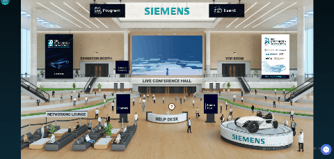
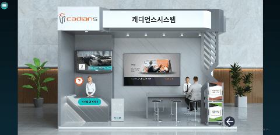
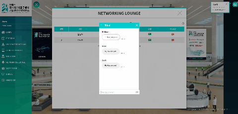
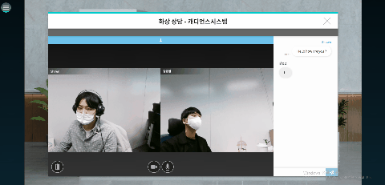
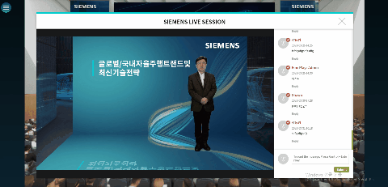
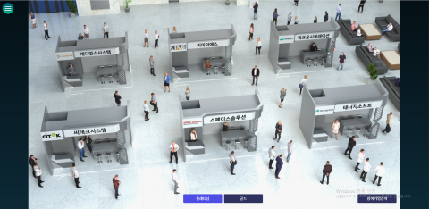
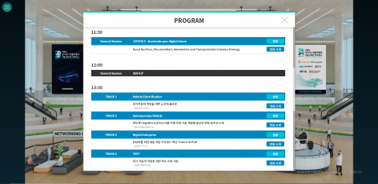
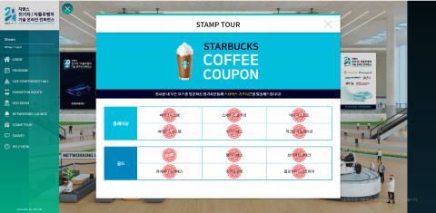

# Siemens online Conference

## Table of Content

<!-- - [Role & Responsibility](#Role--Responsibility)
- [Work Flow](#Application-Work-Flow)
- [Demo](#Demo)
- [Project Description](#Project-Description)
- [Main Features](#Main-features)
- [Achievement](#Achievement)
- [Note](#note) -->

- [Role & Responsibility](#Role--Responsibility)
- [Work Flow](#Application-Work-Flow)
- [Main Features](#Main-features)
- [Note](#note)

# Role & Responsibility

My responsibility was developing both front-end and back-end. Collaborating with management, departments, and customers to identify end-user requirements and specifications. Testing and deploying applications. Troubleshooting, debugging, maintaining and improving existing software.

### My responsibilities in this project include:

- System Design
- Build Admin pages and APIs in nextjs
- Build RESTful APIs in expressjs
- CRUD data in Mysql DB Tables
- Create UIs in React (tables, banners, poppers, Modals, buttons and so on)
- Email, SMS, push notification automation
- Back-up, sql statement automation
- User Authentication
- Schedule VOD and Live Streaming
- Handle browser compatibility (Chrome, Safari, Firefox, MS Edge, IE11)
- Responsive Design (Supports mobile devices)
- Data Statistics
- Gitlab Administration
<!-- - Implement Video chat
- Implement Text chat -->
<!-- - Help Center embedding & Technical Support during the event -->

# Application Work Flow

#### This application was built with Reactjs, Expressjs, MysqlDB and AWS.

<!-- # Demo

### Website URL

#### [Website URL](http://virtualseoul.or.kr/)

While we always allow access to this website, we have closed most of its features since it is not the period of the Event.

### Recording

- [Seoul Map](https://www.youtube.com/watch?v=6EdqKznxncA)
- [LIVE Streaming demo](https://www.youtube.com/watch?v=a9wX4MSkSyg)
- [Video Chat](https://www.youtube.com/watch?v=edzgNn5f5yQ) -->

<!-- # Project Description

This web application was used for the Online Conference held by [Siemens](https://www.siemens.com/global/en.html), Multinational corporation headquartered in Munich, Germany.

- Logged users per day: 2,000 ~ 3,000
- Accessed in: 5 countries
- Accessed by: Desktop, Mobile device, Labtop, Tablet
- Accessed on: Chrome, IE, Firefox, Safari, Edge -->

## Main features

### Branding

### Networking

### Counseling

### Lobby

### Live & VOD Streaming

### Exhibition

### Notice board

### Stamp Event

<!--
### This application feels like a real event and offers almost all features that offline events do. -->

<!--

# Achievement

### I've become familiar with Linux terminal.

### I learned how to talk to client, manage schedule and datas -->
<!--
## This project motivated me to build a reactjs open-source library

[Link To My Crontab library](https://www.npmjs.com/package/reactjs-crontab)

I realised building a crontab (scheduling jobs) is quite tedious and difficult to test. This motivated me to create a node open-source package, which allows you to easily build a crontab functionality. I created this package entirely on my own. There is an average of approximately 300 weekly downloads.
-->
# Note

Due to the company policy, I am unable to open the source code.
